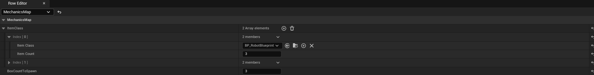

# Система генерации миникарты

Система генерации миникарты представлена по пути

`ProtocolTemintate/Utilities/MiniMapGenerator`

`Она состоит из одного основного класса (BP_MapCapture).`

К ней приложен Utility виджет, представляющий Preview - `EU_SceneCapturePreview. Чтобы его запустить нажмите по нему ПКМ -> Run Utility Widget.`

### `Чтобы захватить карту:`

1. `расположите BP_MapCapture так, чтобы камера смотрела перпендикулярно вниз.`
2.  `Не забудьте указать Render Target текстуры`

    <figure><figcaption></figcaption></figure>

3.  Добавьте акторы пола в массив Floor Actors\

    <figure><figcaption></figcaption></figure>

4. Готово. Теперь, когда вы будете перемещать BP\_MapCapture или нажимать Refresh в EU`_SceneCapturePreview, текстура будет обновляться.`

## `FAQ:`

1. Q: Все шаги выполнены, но текстура не появляется\
   A: Убедитесь, что NavMeshBounds Volume стоит на уровне и отображается (латинская клавиша P)
2. Q: Текстура есть, но материал черный\
   A: Убедитесь, что вы указали акторы пола
3. Q: Полученное изображение содержит много лишних элементов NavMesh\
   A: Настройте NavMesh. Исключите лишние регионы с помощью NavModifierVolume, или отметьте на нужных объектах галочку CanEverAffectNavigation, чтобы исключить его из генерации.
